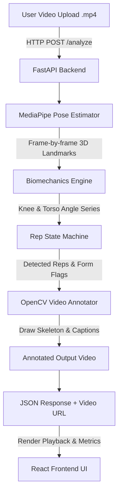

<div align="center">

# 🏋️‍♂️ AI Fitness Form Checker

**An intelligent computer vision application that analyzes squat mechanics, tracks joint angles frame-by-frame, and provides biomechanical feedback with skeleton-annotated video rendering.**

[](https://www.python.org/)
[](https://fastapi.tiangolo.com/)
[](https://ai.google.dev/edge/mediapipe/solutions/vision/pose_landmarker)
[](https://react.dev/)
[](https://vitejs.dev/)
[](https://www.docker.com/)

</div>

---

## 📌 Overview

The **AI Fitness Form Checker** is an end-to-end full-stack computer vision application designed to evaluate squat movement quality from side-view videos. It automatically detects body landmarks, computes key movement metrics (squat depth knee angle & torso forward lean angle), tracks reps using a time-series state machine, and renders an annotated output video complete with a skeleton overlay and per-rep feedback.

---

## ✨ Key Features

- 🎯 **Automated Landmark Extraction**: Uses MediaPipe Pose to capture 33 3D skeletal landmarks frame-by-frame with dynamic side-selection (left vs. right profile visibility).
- 📐 **Biomechanical Calculations**:
  - **Squat Depth**: Calculates knee flexion angle (Hip-Knee-Ankle vector angle). Flags reps where knee angle $> 100^\circ$ at bottom position.
  - **Torso Lean**: Computes forward trunk inclination relative to vertical. Flags excessive forward lean ($> 45^\circ$).
- 🔄 **State Machine Rep Detection**: Time-series analysis tracks eccentric, bottom inflection, and concentric phases to isolate individual reps cleanly.
- 📹 **Annotated Video Synthesis**: OpenCV-powered video processing pipeline renders a high-contrast skeleton overlay and real-time rep status captions directly onto the video.
- 💻 **Modern Web Interface**: Clean React 19 + Vite frontend featuring drag-and-drop video uploads, live processing status, video playback, and rep-by-rep telemetry breakdown.
- 🐳 **Production & Cloud Ready**: Fully containerized backend with Docker and Render Blueprint (`render.yaml`) for 1-click deployment.

---

## 🏗️ System Architecture & Workflow



---

## 📁 Project Structure

```
fitness-form-checker/
├── render.yaml               # Render Cloud Deployment Blueprint
├── README.md                 # Project Documentation
├── .gitignore                # Root Git Ignore configuration
├── backend/
│   ├── main.py               # FastAPI application & REST endpoints
│   ├── Dockerfile            # Container definition for Python + OpenCV + MediaPipe
│   ├── .dockerignore         # Docker ignore rules
│   ├── requirements.txt      # Python dependencies
│   ├── test_pose_analysis.py # Unit test suite with synthetic landmark data
│   ├── app/
│   │   ├── __init__.py
│   │   ├── pose_analysis.py  # Angle geometry & rep detection state machine
│   │   └── video_processor.py# OpenCV skeleton drawing & video rendering engine
│   ├── uploads/              # Temporary upload directory (.gitkeep)
│   └── outputs/              # Processed annotated videos (.gitkeep)
└── frontend/
    ├── package.json          # Node dependencies & scripts
    ├── vite.config.js        # Vite configuration
    ├── vercel.json           # Vercel SPA routing configuration
    ├── .env.example          # Environment variables template
    ├── index.html            # Entry HTML
    └── src/
        ├── App.jsx           # Main UI container
        ├── App.css           # Global layout & styling
        ├── main.jsx          # React entry point
        └── components/
            ├── UploadForm.jsx# File upload dropzone component
            └── VideoResult.jsx# Video player & rep metrics dashboard
```

---

## ⚙️ Local Development Setup

### Prerequisites

- **Python**: 3.10 or higher
- **Node.js**: 18.0 or higher
- **npm** or **yarn**

### 1. Backend Setup

```bash
# Navigate to backend directory
cd backend

# Create virtual environment
python3 -m venv venv

# Activate virtual environment
# On macOS / Linux:
source venv/bin/activate
# On Windows (Command Prompt):
# venv\Scripts\activate

# Install dependencies
pip install -r requirements.txt

# Run backend unit tests (validates angle math & rep detection logic)
python test_pose_analysis.py

# Start FastAPI development server
uvicorn main:app --reload --port 8000
```

The API will be available at `http://localhost:8000`. Interactive OpenAPI documentation is accessible at `http://localhost:8000/docs`.

### 2. Frontend Setup

```bash
# Navigate to frontend directory
cd frontend

# Install Node dependencies
npm install

# Configure environment variables
cp .env.example .env

# Start Vite development server
npm run dev
```

Open your browser to `http://localhost:5173` to access the application.

---

## 📡 API Reference

### Health Check
`GET /health`
- **Response**: `{"status": "ok"}`

### Analyze Video
`POST /analyze`
- **Content-Type**: `multipart/form-data`
- **Form Parameters**:
  - `file` *(UploadFile)*: MP4 video file of squat exercise (side view).
  - `exercise` *(string)*: Exercise type (currently supports `"squat"`).
- **Response Example**:
```json
{
  "job_id": "a1b2c3d4-e5f6-7890-abcd-ef1234567890",
  "summary": "Completed 3 reps: 2 good form, 1 flagged.",
  "side_analyzed": "RIGHT",
  "fps": 30.0,
  "total_frames": 180,
  "reps": [
    {
      "rep_number": 1,
      "min_knee_angle": 92.4,
      "torso_angle_at_bottom": 32.1,
      "is_good": true,
      "issues": [],
      "timestamp_seconds": 2.15
    },
    {
      "rep_number": 2,
      "min_knee_angle": 108.5,
      "torso_angle_at_bottom": 48.2,
      "is_good": false,
      "issues": [
        "Did not achieve full depth (knee angle 108.5° > 100°)",
        "Excessive forward torso lean (48.2° > 45°)"
      ],
      "timestamp_seconds": 4.50
    }
  ],
  "annotated_video_url": "/videos/a1b2c3d4-e5f6-7890-abcd-ef1234567890_annotated.mp4"
}
```

### Get Processed Video
`GET /videos/{filename}`
- **Response**: Serves the annotated `.mp4` video binary stream.

---

## 🚀 Deployment Guide

### Option A: 1-Click Deployment on Render (Backend + Frontend)

This repository includes a `render.yaml` blueprint configured for automatic dual-service deployment:

1. Push your repository to **GitHub**.
2. Log into [Render Dashboard](https://dashboard.render.com/).
3. Click **New +** -> **Blueprint**.
4. Connect your GitHub repository.
5. Render will automatically detect `render.yaml` and provision:
   - **Web Service (Docker)** for FastAPI backend with OpenCV & MediaPipe dependencies.
   - **Static Site** for Vite React frontend linked to the backend URL.

### Option B: Deploy Backend Container to Render / Railway / Fly.io

Build and run using Docker locally or in production:

```bash
cd backend
docker build -t fitness-form-checker-backend .
docker run -p 8000:8000 fitness-form-checker-backend
```

### Option C: Deploy Frontend to Vercel or Netlify

1. Push code to GitHub.
2. Import project in [Vercel](https://vercel.com/) or [Netlify](https://netlify.com/).
3. Set Root Directory to `frontend`.
4. Build Command: `npm run build`
5. Output Directory: `dist`
6. Add Environment Variable:
   - `VITE_API_URL`: Your deployed FastAPI backend URL (e.g., `https://your-backend.onrender.com`).

---

## 🐙 Adding to GitHub

To push this project to your GitHub account, run the following commands in your terminal:

```bash
# 1. Initialize Git repository
git init -b main

# 2. Add all project files
git add .

# 3. Commit changes
git commit -m "feat: initial commit of AI Fitness Form Checker"

# 4. Create repository on GitHub (via GitHub Web UI or GitHub CLI)
# If using GitHub CLI:
# gh repo create fitness-form-checker --public --source=. --remote=origin --push

# If using standard Git remote:
git remote add origin https://github.com/YOUR_USERNAME/fitness-form-checker.git
git branch -M main
git push -u origin main
```

---

## 🤝 Contributing

Contributions, issues, and feature requests are welcome! Feel free to check the issues page or submit pull requests for new exercise detections (e.g., pushups, deadlifts).

---

## 📄 License

This project is open-source and available under the [MIT License](LICENSE).
