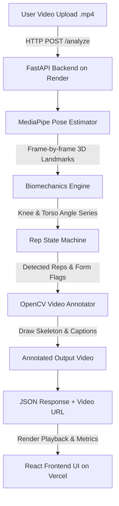

<div align="center">

# 🏋️‍♂️ AI Fitness Form Checker

**An intelligent computer vision application that analyzes squat mechanics, tracks joint angles frame-by-frame, and provides biomechanical feedback with skeleton-annotated video rendering.**

[](https://form-check-ten.vercel.app)
[](https://fitness-form-checker-backend.onrender.com/docs)
[](https://www.python.org/)
[](https://fastapi.tiangolo.com/)
[](https://ai.google.dev/edge/mediapipe/solutions/vision/pose_landmarker)
[](https://react.dev/)

</div>

---

## 🚀 Live Deployments

- 🖥️ **Frontend Application (Vercel)**: [https://form-check-ten.vercel.app](https://form-check-ten.vercel.app)
- ⚙️ **Backend API (Render)**: [https://fitness-form-checker-backend.onrender.com](https://fitness-form-checker-backend.onrender.com)
- 📖 **Interactive Swagger API Docs**: [https://fitness-form-checker-backend.onrender.com/docs](https://fitness-form-checker-backend.onrender.com/docs)
- 🐙 **GitHub Repository**: [https://github.com/GaurangMangla/FormCheck](https://github.com/GaurangMangla/FormCheck)

---

## 📌 Overview

The **AI Fitness Form Checker** is an end-to-end full-stack computer vision application designed to evaluate squat movement quality from side-view videos. It automatically detects body landmarks, computes key movement metrics (squat depth knee angle & torso forward lean angle), tracks reps using a time-series state machine, and renders an annotated output video complete with a skeleton overlay and per-rep feedback.

---

## ✨ Key Features

- 🎯 **Automated Landmark Extraction**: Uses MediaPipe Pose to capture 33 3D skeletal landmarks frame-by-frame with dynamic side-selection (left vs. right profile visibility).
- 📐 **Biomechanical Calculations**:
  - **Squat Depth**: Calculates knee flexion angle (Hip-Knee-Ankle vector angle). Flags reps where knee angle $> 100^\circ$ at bottom position.
  - **Torso Lean**: Computes forward trunk inclination relative to vertical. Flags excessive forward lean ($> 45^\circ$).
- 🔄 **State Machine Rep Detection**: Time-series analysis tracks eccentric, bottom inflection, and concentric phases to isolate individual reps cleanly.
- 📹 **Annotated Video Synthesis**: OpenCV-powered video processing pipeline renders a high-contrast skeleton overlay and real-time rep status captions directly onto the video.
- 💻 **Modern Web Interface**: Clean React 19 + Vite frontend featuring drag-and-drop video uploads, live processing status, video playback, and rep-by-rep telemetry breakdown.
- 🐳 **Production & Cloud Ready**: Fully containerized backend with Docker, Vercel SPA routing, and Render Blueprint (`render.yaml`) for 1-click deployment.

---

## 🏗️ System Architecture & Workflow



---

## 📁 Project Structure

```
fitness-form-checker/
├── render.yaml               # Render Cloud Deployment Blueprint
├── README.md                 # Project Documentation
├── LICENSE                   # MIT License
├── .gitignore                # Root Git Ignore configuration
├── backend/
│   ├── main.py               # FastAPI application & REST endpoints
│   ├── Dockerfile            # Container definition for Python + OpenCV + MediaPipe
│   ├── .dockerignore         # Docker ignore rules
│   ├── requirements.txt      # Python dependencies
│   ├── test_pose_analysis.py # Unit test suite with synthetic landmark data
│   ├── app/
│   │   ├── __init__.py
│   │   ├── pose_analysis.py  # Angle geometry & rep detection state machine
│   │   └── video_processor.py# OpenCV skeleton drawing & video rendering engine
│   ├── uploads/              # Temporary upload directory (.gitkeep)
│   └── outputs/              # Processed annotated videos (.gitkeep)
└── frontend/
    ├── package.json          # Node dependencies & scripts
    ├── vite.config.js        # Vite configuration
    ├── vercel.json           # Vercel SPA routing configuration
    ├── .env.example          # Environment variables template
    ├── index.html            # Entry HTML
    └── src/
        ├── App.jsx           # Main UI container
        ├── App.css           # Global layout & styling
        ├── main.jsx          # React entry point
        └── components/
            ├── UploadForm.jsx# File upload dropzone component
            └── VideoResult.jsx# Video player & rep metrics dashboard
```

---

## ⚙️ Local Development Setup

### Prerequisites

- **Python**: 3.10 or higher
- **Node.js**: 18.0 or higher
- **npm** or **yarn**

### 1. Backend Setup

```bash
# Navigate to backend directory
cd backend

# Create virtual environment
python3 -m venv venv
source venv/bin/activate

# Install dependencies
pip install -r requirements.txt

# Run backend unit tests
python test_pose_analysis.py

# Start FastAPI development server
uvicorn main:app --reload --port 8000
```

### 2. Frontend Setup

```bash
# Navigate to frontend directory
cd frontend

# Install Node dependencies
npm install

# Configure environment variables
cp .env.example .env

# Start Vite development server
npm run dev
```

---

## 📄 License

This project is open-source and available under the [MIT License](LICENSE).
